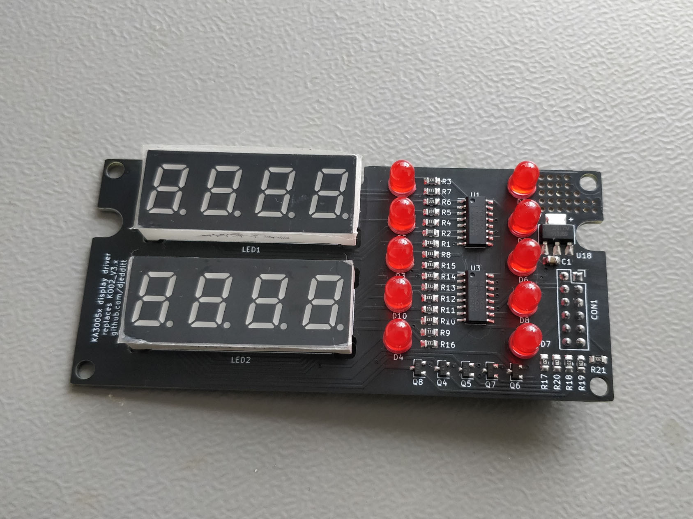
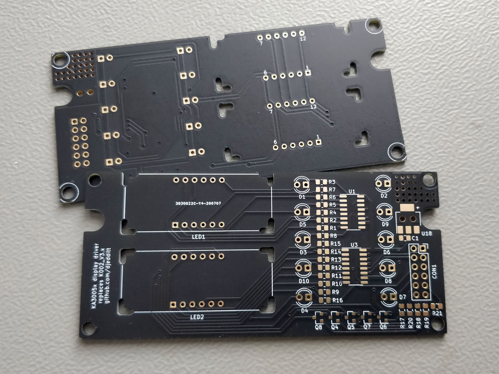

# ka3005p-display

This repository contains a KiCad project for a Korad KA3005P display driver, included are the schematic, pcb layout and gerber files. This board can replace the existing KA002_V3.x PCB in a Korad KA3005P (or KA3005D) power supply.

## Table of Contents

* [Bill of Materials (BOM)](#bom)
* [Pictures](#pictures)
* [License](#license)
* [Contact](#contact)

## Bill of Materials (BOM)

Below you'll find the bill of materials for this board. The original PCB comes with 4.0mm LEDs, but I went for 5.0mm because those are more readily available.

| ID | Designator | Description | Quantity |
|---|---|---|---|
|1|C1|Capacitor, Ceramic, 22uF, 25V, 10%, X7R, 0805|1|
|2|LED1, LED2|4-Digit 7-Segment LED Display, Red, Common Cathode, TH, 0.40"|2|
|3|R17, R18, R19, R20, R21|Resistor, 1k Ohm, 1%, 1/8 W, 0805|5|
|4|Q4, Q5, Q6, Q7, Q8|NPN Transistor, MMBT3904, SOT-23-3|5|
|5|D1, D2, D3, D4, D5, D6, D7, D8, D9, D10|LED, Red, TH, 4.0mm (or 5.0mm)|10|
|6|U18|Low Dropout Linear Regulator, AZ1117-3.3, SOT-223|1|
|7|R1, R2, R3, R4, R5, R6, R7, R8, R9, R10, R11, R12, R13, R14, R15, R16|Resistor, 330 Ohm, 5%, 1/4 W, 0805|16
|8|U1, U3| 8-Bit Shift Register, 74HC595, SOIC-16|2
|9|CON1| Female Header, 12-Pin (2x6), 2.54mm|1

## Pictures

The finished board:

Bare PCB (front and back):

## License

This work is licensed under a [Creative Commons Attribution 4.0 International
License][cc-by].

[cc-by]: http://creativecommons.org/licenses/by/4.0/ 

## Contact

You can e-mail me at: ![email-address]

[email-address]: https://djedditt.net/github/email-address.gif